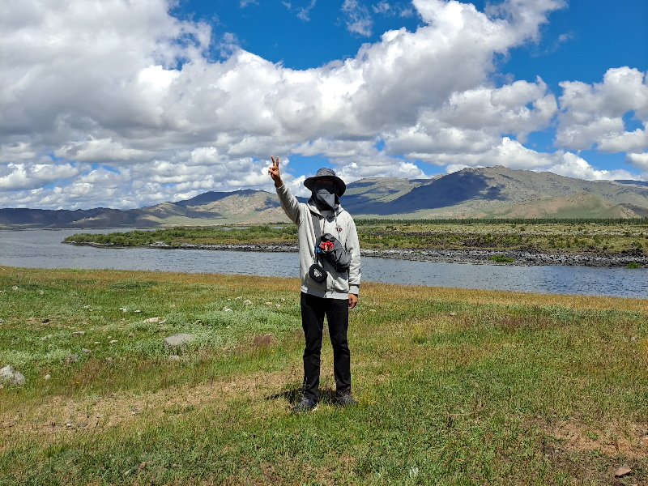

-----

**Sanghyuk Jung (Officialy Sanghyeok Jeong)**

Geography Student

- Major in geography education in Korea University, Seoul (2021~)

- Leader of KUGE Educational Policy Student Society 'Kyoyukbu' (2022)

- Leader of KUGE GIS Student Society 'GIScosm' (2023~)

Interested In...

- Geocomputation

- Spatial Statistics

- Geodemography

Downloads

- [Notepad++ for Statistics (R-4.3.0 Required)](https://drive.google.com/file/d/1ADIlBY3Fg0mxK5lHW-W29gVxhYPmr-d_/view?usp=share_link)

- [Sanghyuk's Geocoder](https://drive.google.com/file/d/13L4FAFFFiBL59AFKOcNStW-9Mu-k-BnB/view?usp=share_link)

Links

- [GitHub](https://github.com/hkgeo)

- [Blog](https://blog.naver.com/nacl31566)

- [Instagram](https://www.instagram.com/sang_hk__/)
